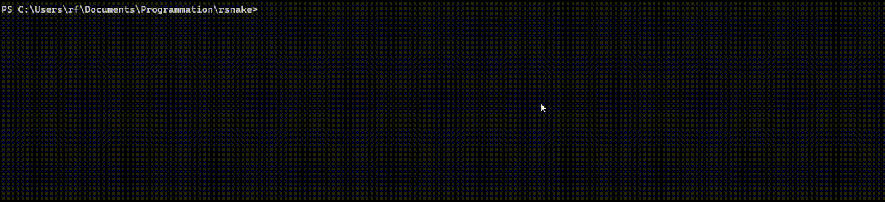
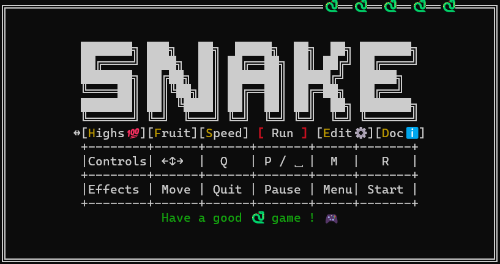
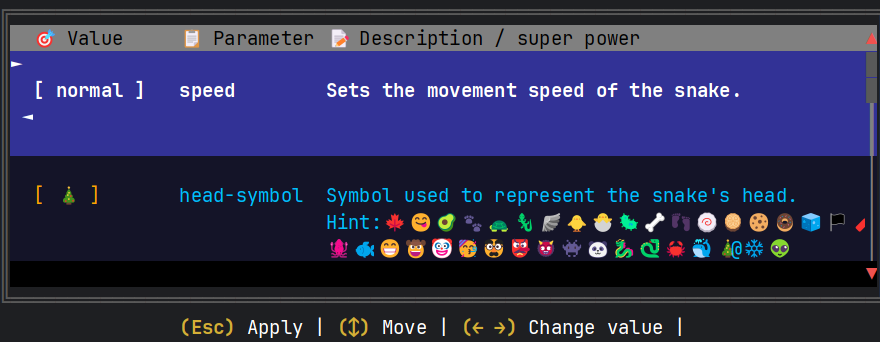
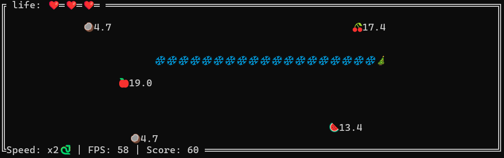

[](https://crates.io/crates/rsnaker)
[](https://docs.rs/rsnaker)
[](https://opensource.org/licenses/)
[](https://github.com/FromTheRags/rsnake/commits)
[](https://github.com/FromTheRags/rsnake/actions/workflows/build.yml)
[](https://github.com/FromTheRags/rsnake/actions/workflows/test.yml)
[](https://github.com/FromTheRags/rsnake/actions/workflows/cargo-deny.yml)
[](https://fromtherags.github.io/rsnake/rsnaker/index.html)
[](https://github.com/FromTheRags/rsnake)
<!-- 
[](https://github.com/FromTheRags/rsnake)
As tokei server seems unreliable with messages as "Invalid SHA provided."/bandwidth issues and not actively maintained 
, the best is yet a static badge yielding the total amount of code get from the command:`tokei`
in a local terminal (having a GitHub action with writing privilege just for that is overkill) -->

# Snake Game using Ratatui

It is a terminal-based snake game using the Ratatui crate for rendering.





## Features

- **Terminal UI**: Uses Ratatui for rendering a grid-based game.
- **Game Logic**: Manages snake movement, collisions, and scoring.
- **Multithreading**: Uses multiple threads for input handling, rendering at 60 FPS, and game logic execution.
- **Emoji-based graphics**: Supports rendering the snake using emojis instead of ASCII.
- **Configurable parameters**: With `clap` for command-line arguments & toml file.

## Installation from release

### ✅ Prerequisites

- 💻 **Use a terminal that supports emoji**
    - On **Windows**, the [new Microsoft terminal](https://apps.microsoft.com/detail/9n0dx20hk701?hl=en-us&gl=US)
      shipped with w11 (and compatible w10) supports emoji out of the box among other improvements.
    - On **Linux** / Android, you could need to install the Noto Emoji font:
      👉 [Emoji font support](INSTALLATION.md#enable-emoji-font-support) for instructions.
    - Some screen displays can flicker at 60 FPS in the terminal, use a decent display or an external monitor.

### Running

- Download the latest release from the [release page](https://github.com/FromTheRags/rsnake/releases) according to your
  OS.
- Run the executable using the terminal or double-click on the file if your OS supports it.
- For windows:
    - Search for "Terminal" in the search menu to launch it and **set as default** (to be able to run the snake by
      double-clicking the .exe) or run rsnake from the terminal with:
    - `cd "download path"` then `.\rsnake-x86_64-pc-windows-msvc.exe`
- For Linux/macOS:
    - `cd "download path" && ./rsnake-x86_64-unknown-linux-musl` (or `./rsnake-x86_64-apple-darwin` on macOS)
- For android:
    - Dedicated Android binary (`rsnake-aarch64-linux-android`) or static musl build
      (`rsnake-aarch64-unknown-linux-musl`) for emulated linux with proot.
    - For easier use, END key works as ENTER, "-" as a pause key, HOME for Menu, Tab to quit.
    - Use a linux emulator, tested with:
        - [UserLand](https://github.com/CypherpunkArmory/UserLAnd) (I have committed
          a [PR](https://github.com/CypherpunkArmory/UserLAnd-Assets-Support/pull/144) to be integrated by default,
          see [fork](https://github.com/FromTheRags/UserLAnd-Assets-Support)), with debian/Ubuntu. Use the
          `rsnake-aarch64-unknown-linux-musl` version.
        - [Android 17 build-in terminal Terminal Android (Debian / AVF)](https://source.android.com/docs/core/virtualization/usecases), [Getting started guide](https://itsfoss.com/news/google-android-linux-terminal-rollout/)
          use the `rsnake-aarch64-unknown-linux-musl` version.
        - [Andronix](https://andronix.app/): not tested but should work (as it is proot based). Use the
          `rsnake-aarch64-unknown-linux-musl` version.
        - [Termux](https://github.com/termux/termux-app)
          or [ADB Shell](https://developer.android.com/tools/adb#shellcommands) use the `rsnake-aarch64-linux-android`
          version.

    - Download from the release page:
    ```bash 
      wget -O rsnake https://github.com/FromTheRags/rsnake/releases/latest/download/rsnake-aarch64-linux-android
      # or
      wget -O rsnake https://github.com/FromTheRags/rsnake/releases/latest/download/rsnake-aarch64-unknown-linux-musl
      chmod +x rsnake
      ./rsnake
    ```

In case pre-build binaries are not enough, you can build from
source [Installation from source](#installation-from-source)

### Run Game options

- To see run options, use: `rsnake --help`
- E.g., `rsnake -z 🐼 -b 🍥` or `cargo run -- -z 🐼 -b 🍥` (if from source)

### TOML Presets

- To save a set of parameters:
    - Use the in-game menu "edit", load a slot (with a number between 1 and 7), make your modification with arrows keys,
      then save with 'x'
    - Create and alias for the CI option
- Then load with `--load` option or using the in-game menu "edit".  
  NB: You can download some of the [Best Configurations](Best_configurations) and put it in the same folder as the
  executable

## Installation from source

### ✅ Prerequisites

- 🦀 **Have Rust and compilation tools installed**  
  If you don't have Rust yet:
    - On **Windows**, Install Rust using the official .exe installer https://www.rust-lang.org/tools/install (as it
      works Out-Of-The-Box on Windows)
    - On **Linux**/ Android with linux emulator 👉 [Installation Rust and tools for Linux](INSTALLATION.md) for
      instructions

### Running from source

#### Short path

- Using cargo only: `cargo install --locked rsnaker --force`
- To run the game execute: `rsnake`, if not found, the binary is in `~/.cargo/bin/rsnake`

#### Long path

- Clone this repository
  `git clone https://github.com/FromTheRags/rsnake.git`
- Go to the directory `cd rsnake`
- To run the game, either:`cargo run` or `cargo run --manifest-path rsnake/Cargo.toml` (if in another directory)
- To install the game as a command:  
  `cargo install --path .`  
  And then run the game with: `rsnake`
- See [Run option below for more details](#run-game-options).

## Architecture

Full details are available in [architecture.md](ARCHITECTURE.md).

- ### Logging Configuration

The logging subsystem is configured from a **dedicated** TOML file (`snake_log_config.toml`), separate from the game
options file. It is read **only once at startup**, and is **deserialization-only** (the game never writes back to it).
If the file is missing or invalid, sensible defaults are used.

```toml
# snake_log_config.toml
level = "off"                                              # off, error, warn, info, debug, trace
file_name = "snake.log"                                    # output log file (current directory)
time_format = "[hour]:[minute]:[second].[subsecond digits:6]"  # `time` crate format description
with_ansi = false                                          # ANSI colors in the log file
with_target = false                                        # include the module path (target)
with_thread_names = true                                   # include thread names
with_thread_ids = false                                    # include thread ids
with_line_number = true                                    # include source line numbers
with_file = true                                           # include source file names
with_level = true                                          # include the log level
```

The CLI flag `--log-level` (if explicitly set, i.e., not `off`) overrides the level coming from the TOML file via the
hot-reload handle, as well as log option overrides if set in game-preset file/menu.

- Uses `Arc` & `RwLock` for synchronization.
- Spawns separate threads for input handling, rendering (60 Hz), and game logic execution.

## Documentation generation

- `cargo doc --document-private-items --no-deps --open`

## Tests

- As usual run them with `cargo test` the project is set up with a lib containing all the code, and a main.rs just
  calling it
- As this is a widespread pattern providing full compliance with the Rust test ecosystem, allowing doc comment to be
  automatically tested, for example.
- To have a coverage report, install `llvm-cov`:
  ```bash
  rustup component add llvm-tools-preview
  cargo install cargo-llvm-cov
  ```
- And run `cargo llvm-cov --open`
- A great coverage is not a goal for this project (tests are only there to showcase tests in rust),
- For reference, the current coverage is :
  [](https://codecov.io/gh/FromTheRags/rsnake)

## References

- Clippy lints: <https://github.com/rust-lang/rust-clippy/>
- Ratatui tutorial: <https://ratatui.rs/tutorials/hello-ratatui/>
- Example: <https://ratatui.rs/examples/widgets/canvas/>
- Git over-bloated: <https://rtyley.github.io/bfg-repo-cleaner/>
- Gif: [OBS studio](https://obsproject.com/fr/download) full screen with filter to terminal view and
  [ffmpeg](https://ffmpeg.org/)
  with:  
  `ffmpeg -ss 00:00:01 -to 00:00:20 -i input.mp4 -vf "fps=10,scale=1400:-1:flags=lanczos" -loop 0 output.gif`  
  (well better than asciinema)  
  [](https://github.com/fromtherags/rsnake/graphs/contributors)
