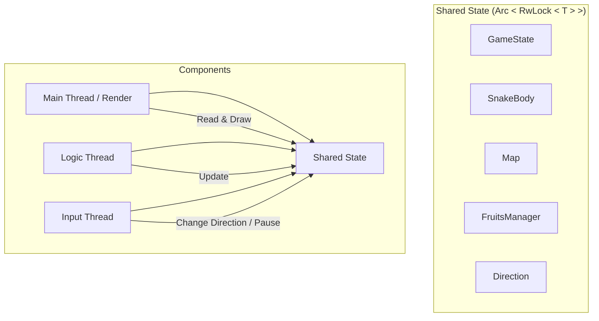
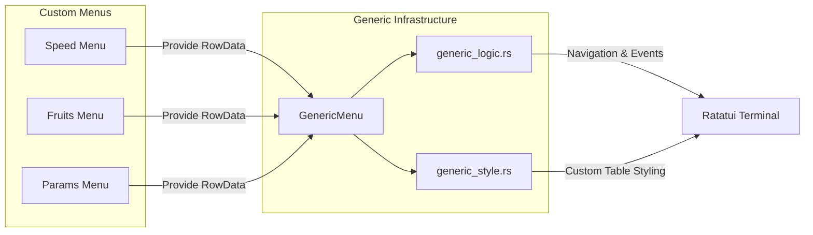
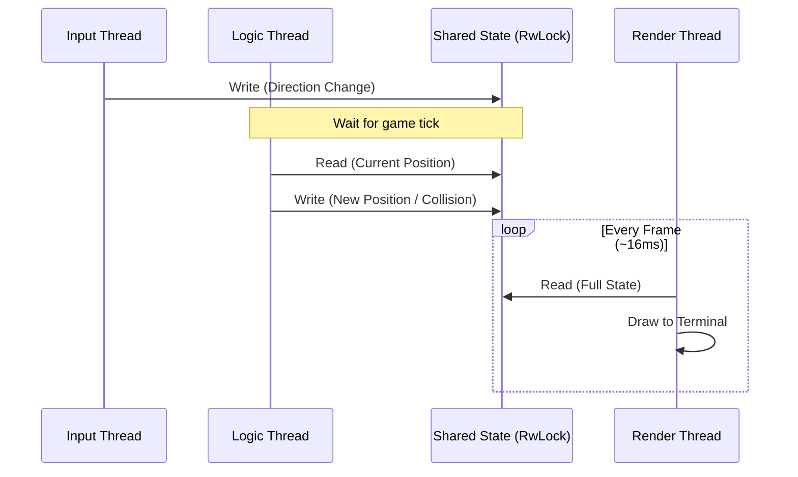

# rsnaker Architecture

This document provides a detailed overview of the software architecture, technical choices, and concurrency model of the
**rsnaker** project.

## 1. System Overview

**rsnaker** is a terminal-based game (TUI) built with Rust. It follows a decoupled architecture where game logic,
rendering, and input handling operate independently to ensure a smooth 60 FPS experience despite terminal constraints.



## 2. Core Libraries & Their Roles

The project leverages the Rust ecosystem for efficiency and reliability:

### 🎮 User Interface & Terminal

- **[Ratatui](https://ratatui.rs/)**: The primary TUI framework. It manages the drawing of widgets and implements an
  immediate-mode rendering pattern with double-buffering. It allows us to treat the terminal as a grid of cells.
- **[Crossterm](https://github.com/crossterm-rs/crossterm)**: Acts as the cross-platform terminal backend. It handles
  raw mode, screen clearing, and listens for keyboard events.

### ⚙️ Logic & Orchestration

- **[Clap](https://clap.rs/)**: Handles command-line argument parsing with a derive-based API. It validates user inputs
  (like snake symbols) at startup and generates the help menu.
- **[Serde](https://serde.rs/) & [TOML](https://github.com/toml-rs/toml)**: The backbone for data serialization.
    - **Configuration**: `GameOptions` uses Serde to load/save TOML presets. It supports attribute-based rename/alias
      (e.g., mapping CLI `snake-length` to internal `snake_length`) and skips non-persistent fields.
    - **Persistence**: High scores are serialized to TOML strings before being stored in Sled, allowing for easy manual
      inspection of the database if needed.
    - **Robustness**: Combined with custom validation logic, Serde ensures that loaded configurations are automatically
      clamped to valid ranges (e.g., preventing a snake length of 0).
- **[Rand](https://crates.io/crates/rand)**: Generates random positions for fruits and determines fruit types based on
  weights.

### 💾 Persistence & Sled DB Design

The game uses **[Sled](https://github.com/spacejam/sled)**, an embedded NoSQL key-value store, to manage high scores.

- **Lexicographical Sorting**: Sled stores keys as raw byte slices and maintains them in lexicographical order.
- **Key Design for "Free" Sorting**:
    - To retrieve top scores without manual sorting, keys are constructed as: `(u32::MAX - score).to_be_bytes()` +
      `unique_id`.
    - Using `u32::MAX - score` flips the order, so higher scores appear first.
    - `to_be_bytes()` (Big-Endian) is critical because it ensures that the most significant bytes are compared first,
      preserving numeric order in a byte-by-byte comparison.
    - `unique_id` (generated via `db.generate_id()`) ensures that multiple entries with the same score don't overwrite
      each other.
- **Value Design**: Values are stored as TOML-serialized strings. This choice prioritizes human-readability and ease of
  debugging over extreme binary compactness, which is appropriate for a high-score table of 10 entries.
- **Database Maintenance**: A `shrink_db` routine runs after every save, using Sled's `range` and `Batch` API to prune
  the database and keep only the top `MAX_SCORE_ENTRIES`.

### 🔍 Observability & Time

- **[Tracing](https://tracing.rs/)**: A framework for structured, asynchronous logging.
    - **Tracing-Subscriber**: Configures how logs are filtered (e.g., disabling `sled` logs while keeping `rsnaker`
      logs) and where they are sent.
    - **Tracing-Appender**: Handles non-blocking writes to log files using a `WorkerGuard` to ensure all logs are
      flushed before the program exits.
    - The logging subsystem is configured from a **dedicated** TOML file (`snake_log_config.toml`), separate from the
      game options file. It is read **only once at startup**, and is **deserialization-only** (the game never writes
      back to it). If the file is missing or invalid, sensible defaults are used.

```toml
# snake_log_config.toml
level = "off"                                              # off, error, warn, info, debug, trace
file_name = "snake.log"                                    # output log file (current directory)
time_format = "[hour]:[minute]:[second].[subsecond digits:6]"  # `time` crate format description
with_ansi = false                                          # ANSI colors in the log file
with_target = false                                        # include the module path (target)
with_thread_names = true                                   # include thread names
with_thread_ids = false                                    # include thread ids
with_line_number = true                                    # include source line numbers
with_file = true                                           # include source file names
with_level = true                                          # include the log level
```

The CLI flag `--log-level` (if explicitly set, i.e., not `off`) overrides the level coming from the TOML file via the
hot-reload handle, as well as log option overrides if set in game-preset file/menu.

- **[Chrono](https://github.com/chronotope/chrono)**: Manages timestamps for high scores, ensuring correct date/time
  serialization via Serde.
- **[Time](https://github.com/time-rs/time)**: Used specifically for high-precision log timestamps in the `tracing`
  output.

## 3. The Grapheme Challenge

One of the main complexities in a TUI game is handling **Emojis** and **Unicode**.

- **The Problem**: In Unicode, a single visible character (a "Grapheme Cluster") can be composed of multiple `char`
  types (e.g., a family emoji 👨‍👩‍👧‍👦). Furthermore, some characters take up two terminal cells (Full-width), while
  others take one.
- **The Solution**:
    - We use **[unicode-segmentation](https://github.com/unicode-rs/unicode-segmentation)** to ensure that symbols
      provided via CLI are exactly one grapheme long.
    - We use **[unicode-width](https://github.com/unicode-rs/unicode-width)** (via Ratatui) to calculate the exact width
      of symbols in the terminal grid, ensuring the game map remains perfectly aligned regardless of whether the player
      uses `ASCII` or `Emoji`.

## 4. Concurrency Model

The game uses a multi-threaded approach to keep the UI responsive:

### A. Threading Strategy

We use `std::thread::scope` to spawn scoped threads. This guarantees that all threads are joined and resources are
cleaned up before the scope closes, preventing "zombie" threads.

- **Render Thread (Main Thread)**:
    - **Frequency**: Capped at 60Hz.
    - **Task**: Reads the shared state and draws the UI. It owns the `Terminal` object.
- **Logic Thread (`t_game_logic`)**:
    - **Frequency**: Variable, based on the `Speed` parameter.
    - **Task**: Calculates movement, checks collisions, and updates scores.
- **Input Thread (`t_input`)**:
    - **Task**: Blocks on `crossterm::event::read` to capture key presses instantly and update the snake's direction.

### B. Synchronization (`Arc<RwLock<T>>`)

To share data safely between these threads:

- **Arc** (Atomic Reference Counting) provides multi-thread ownership.
- **RwLock** (Read-Write Lock) allows **multiple simultaneous readers** (Render and Logic can often read at the same
  time) but grants **exclusive access to writers** (when Logic updates the position).

## 5. Design Patterns

- **MVC (Model-View-Controller)**:
    - **Model**: `GameState`, `SnakeBody`, `Map`.
    - **View**: The `playing_render_loop` using Ratatui.
    - **Controller**: `playing_input_loop` and `playing_logic_loop`.
- **State Pattern**: The `GameStatus` enum drives the application's behavior (Menu, Playing, Pause, GameOver, ByeBye).
- **RAII (Resource Acquisition Is Initialization)**:
    - Terminal "Raw Mode" is managed so that even in case of a crash, the terminal is restored to its original state.
    - `Tracing` guards ensure logs are flushed.
- **Facade**: The `Game` struct acts as a facade, hiding the complexity of thread management and synchronization from
  the `main` function.

## 6. UI Components & View Reuse

The project uses a component-based approach to build its terminal interface, maximizing code reuse across different
menus (Speed, Fruits, Parameters, etc.).

### A. Generic Menu System (`GenericMenu`)

To avoid duplicating logic for every in-game menu, we implemented a `GenericMenu` system. This architecture allows us to
add new settings or information screens by simply defining new data structures rather than rewriting UI code.



- **Data Abstraction**: The menu operates on `RowData` containing `CellValue` variants (`Text` or `Options`). It doesn't
  know if it's editing a snake symbol or a speed setting; it only knows how to navigate rows and cycle through options.
- **Behavior Injection (Genericity)**:
    - **Traits**: The `ActionParameter` trait allows different game modules to define their own "Save" logic. The menu
      holds a `&mut dyn ActionParameter`, decoupling the UI from the specific logic of `GameOptions`.
    - **Closures/Function Pointers**: Features like `LoadPreset` use function pointers to inject data-loading behavior,
      allowing the menu to refresh itself with new data from TOML files without being hardcoded to the file system.
- **Action Mapping**: It uses an `ActionParameter` trait to define what happens when a user saves or modifies a value.
  In `GameOptions`, this is implemented by converting the generic row data back into CLI-style arguments and reparsing
  them, bridging the gap between generic UI and typed configuration.

### B. Separation of Logic and Style

- **Logic (`generic_logic.rs`)**: Manages the state of the menu, including the currently selected row, pagination (via
  scrollbars), and event handling.
- **Style (`generic_style.rs`)**: Encapsulates the visual identity. For example, `TableCustomRetroStyle` wraps Ratatui's
  `Table` widget to apply consistent borders, colors, and highlight styles.

### C. Performance & Resource Management

- **Reference Rendering**: The UI uses Ratatui's `render_widget_ref` and `WidgetRef` trait where possible. This avoids
  cloning large widget structures on every frame, which is crucial for maintaining 60 FPS in a terminal environment.
- **Layout Utilities**: Shared layout functions ensure that menus are always centered or correctly proportioned relative
  to the terminal size, even when the window is resized.

## 7. Data Flow


